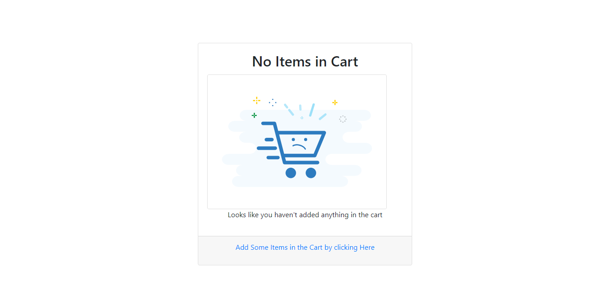
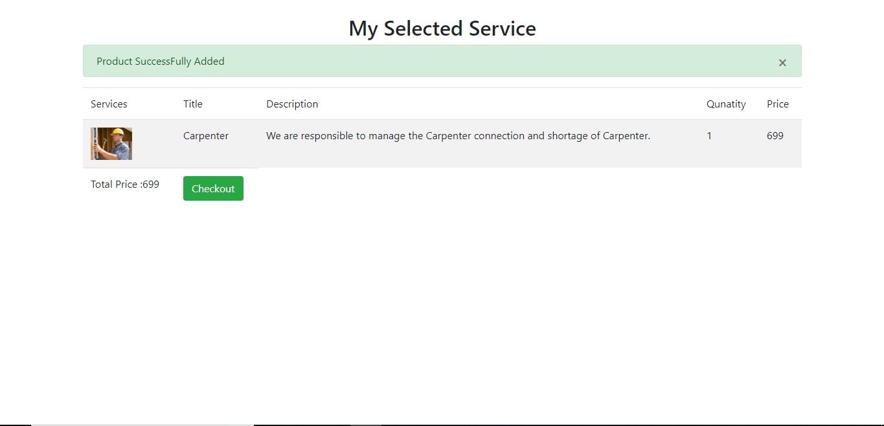
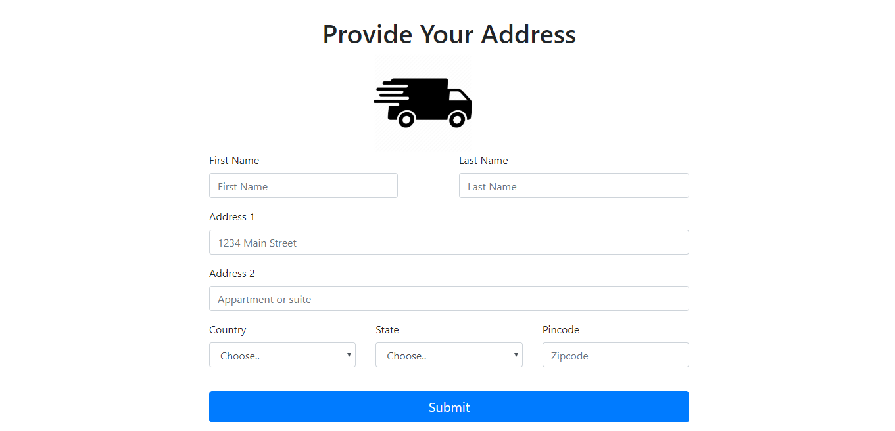
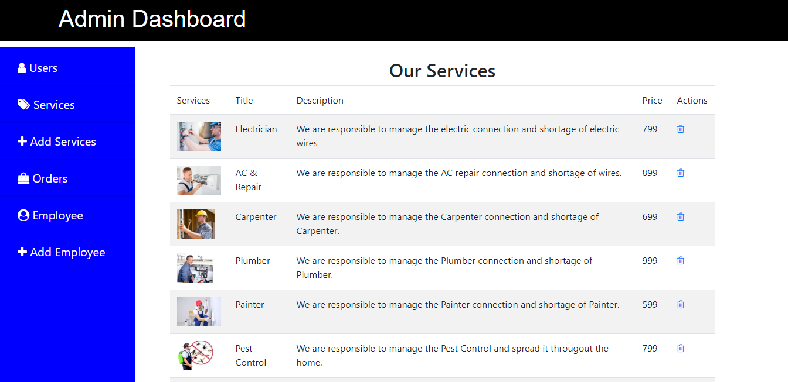

<html>
    <head>
<link rel="stylesheet" href="https://stackpath.bootstrapcdn.com/bootstrap/4.4.1/css/bootstrap.min.css" />
    </head>
    <body>
<h2 class="text-center">Home Maintenance Service</h2>
        
This project consist of following technologies 

        
Lavarel : It is a php Framework which is based on MVC.

        
Bootstrap : It is Frontend library used to create responsive website.
 

This is the Home Page of the website where all services will be listed over here. This services are fetched from database.

If no items is selected we get Empty cart

As soon as we select the items in the cart we will be able to checkout the product 

After clicking on checkout button a new form will be displayed to the user. Here address details will be asked from the user. After filling all the details user has purchased the service successfully.

Admin Area 

Admin can add the product, delete the product, see Employee details etc..

Admin can also add the service from the backend 

    </body>
    </html>
